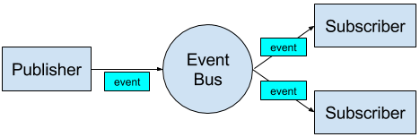

## Simple event bus library for ESP8266.

This library will allow you to:
 - create custom events
 - trigger custom events
 - attach / detach event listeners (callbacks)
 - pass arguments during event trigger
 
All event callbacks are scheduled with timers to not block the CPU when there are many listeners.



## Build and flash the example.

By default Makefile:
- looks for esp-open-sdk in `$HOME/lib/esp-open-sdk/sdk`
- uses `/dev/ttyUSB0` for USB to serial communication
- assumes `esptool.py` exists in user `$PATH`

```
$ make DEBUG_ON=1
$ make flash
```

## Usage.

See [example/main.c](example/main.c).

The output generated by the example program:

```
system initialized
callback pointers:
 event1: 0x402157a8
 event2: 0x402157c8

List state:
    batteryLow 0x402157a8
    batteryLow 0x402157c8

List state:
    batteryLow 0x402157c8
    batteryFull 0x402157c8

List state:
    batteryLow 0x402157c8
    batteryFull 0x402157c8
    throttled 0x402157e8
    
event2_cb batteryLow handled with arg: 123
event2_cb batteryFull handled with arg: 321
event throttled throttled handled with arg: 123
event2_cb batteryFull handled with arg: 321
```

The last line should appear after about 5 seconds.

## Integration.

The best way to integrate this library is to use git subtree.

To add source to your project use:

```text
$ git remote add -f esp-eb git@github.com:rzajac/esp-eb.git
$ git subtree add --prefix lib/esp_eb esp-eb master --squash
```

To pull updates.

```text
$ git subtree pull --prefix lib/esp_eb esp-eb master --squash
```

## License.

[Apache License Version 2.0](LICENSE) unless stated otherwise.